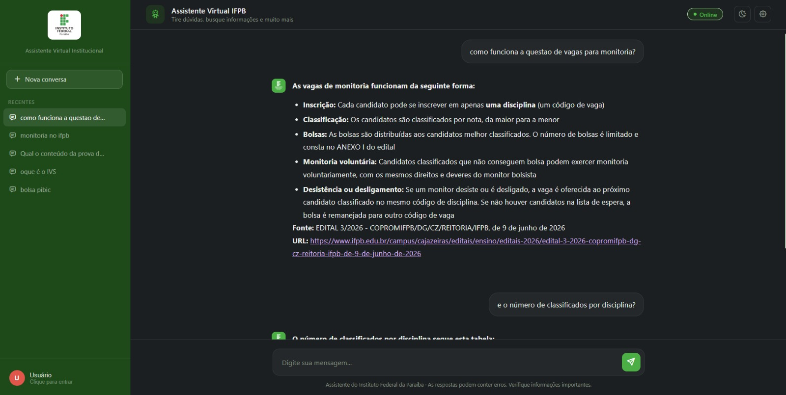

# Assistente Institucional IFPB

Assistente virtual conversacional para o Instituto Federal da Paraíba — Campus Cajazeiras. Permite que alunos, servidores e a comunidade acadêmica tirem dúvidas institucionais em linguagem natural, sem precisar navegar por documentos ou portais.

> Acesso: _em breve_



---

## O que ele faz

- Responde perguntas sobre o IFPB com base em documentos institucionais reais
- Mantém histórico de conversas por sessão
- Permite criar múltiplos chats e alternar entre eles
- Persiste o histórico no banco de dados para usuários cadastrados

---

## Como funciona

O assistente usa **RAG (Retrieval-Augmented Generation)** — antes de responder, ele busca os trechos mais relevantes da base de documentos institucionais e os usa como contexto para a resposta do modelo de linguagem. Isso reduz alucinações e garante que as respostas sejam baseadas em informações reais do IFPB.

A recuperação combina busca densa (vetorial) e busca esparsa (léxica), com um reranker filtrando os candidatos antes de montar o contexto final:

```
Pergunta do usuário
    → multiquery (reformulações da pergunta original)
    → busca híbrida por reformulação: densa (Qdrant) + esparsa (BM25)
    → reranker seleciona os candidatos mais relevantes
    → contexto relevante + histórico da conversa
    → modelo de linguagem (LLM)
    → resposta
```

Documentos com tabelas (cronogramas, editais de vagas, listas) passam por um chunking dedicado: cada tabela é dividida em unidades pai/filho (parent-child), permitindo recuperar tanto a linha específica quanto o contexto completo da tabela quando necessário.

A qualidade do pipeline é medida com [RAGAS](https://docs.ragas.io/), acompanhando `context_precision`, `context_recall`, `answer_relevancy`, `faithfulness` e `answer_correctness` a cada mudança relevante — ver `tests/evaluation/`.

---

## Stack

**Backend**
- [FastAPI](https://fastapi.tiangolo.com/) — API REST
- [SQLModel](https://sqlmodel.tiangolo.com/) — ORM e schemas
- [PostgreSQL](https://www.postgresql.org/) — dados relacionais (usuários, chats, mensagens)
- [Qdrant](https://qdrant.tech/) — banco vetorial para busca semântica
- [LangChain](https://www.langchain.com/) — pipeline RAG

**Avaliação**
- [RAGAS](https://docs.ragas.io/) — avaliação de recuperação e geração (context precision/recall, faithfulness, answer relevancy/correctness)

**Frontend**
- HTML, CSS e JavaScript puro — sem frameworks
- localStorage como cache de sessão

---

## Funcionalidades

### Sem cadastro
- Conversar com o assistente
- Criar e alternar entre múltiplos chats
- Histórico salvo localmente no navegador

### Com cadastro
- Histórico persistido no servidor
- Acesso ao histórico em qualquer dispositivo
- Migração automática dos chats locais ao criar conta

---

## Estrutura do projeto

```
app/
├── api/
│   ├── services/       → lógica de negócio
│   └── v1/
│       └── routes/     → controllers e rotas
├── chatbot/            → engine RAG, memória, retriever
├── core/               → segurança (JWT, hash de senha)
├── database/           → conexão com PostgreSQL e Qdrant
├── models/             → schemas e models SQLModel
└── repositories/       → queries no banco

rag/
├── chunking/           → divisão de documentos em chunks (incl. parent-child para tabelas)
├── crawler/             → coleta de documentos institucionais
├── extraction/          → extração de texto dos documentos
└── indexing/            → indexação dos chunks no Qdrant

frontend/
├── index.html
├── js/
│   ├── script.js       → entry point
│   ├── auth.js         → autenticação
│   ├── chat.js         → gerenciamento de chats
│   ├── ui.js            → renderização
│   ├── storage.js       → localStorage
│   └── modal.js         → modal de auth
└── css/                 → estilos divididos por módulo

docs/
├── api/                 → documentação dos endpoints
└── architecture/        → diagramas e decisões técnicas

tests/
└── evaluation/          → avaliação do pipeline RAG (RAGAS) e registro de experimentos
```

---

## Documentação

- [Arquitetura do banco de dados](docs/architecture/database.md)
- [Registro de otimizações do RAG](docs/retrieval/rag_evaluation.md) — histórico de experimentos e métricas RAGAS

---

## Autor

Desenvolvido por [Yuri Kiev](https://github.com/yurikiev) como projeto de portfólio.
IFPB — Campus Cajazeiras.