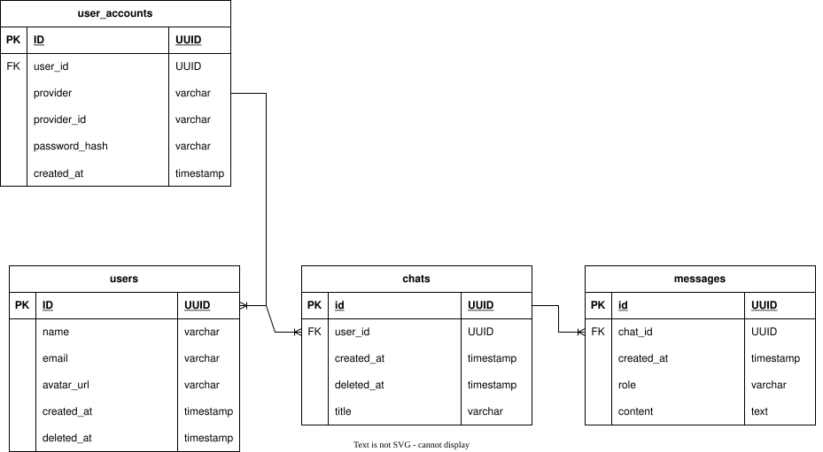

# Banco de Dados

## Visão geral

O projeto utiliza dois bancos de dados com responsabilidades distintas:

- **Qdrant** — banco vetorial responsável pela busca semântica nos documentos institucionais do IFPB
- **PostgreSQL** — banco relacional responsável por usuários, sessões de chat e histórico de mensagens

## Por que dois bancos?

O Qdrant é especializado em busca por similaridade vetorial, que é o núcleo do pipeline RAG.
O PostgreSQL cuida dos dados relacionais da aplicação, onde consultas estruturadas e integridade
referencial importam mais do que busca semântica.

Manter as responsabilidades separadas evita a necessidade de extensões como pgvector, que
adicionariam complexidade ao PostgreSQL sem benefício real, dado que o Qdrant já está na stack.

## Modelagem relacional

### Decisões de design

- UUIDs como chave primária em todas as tabelas — evita expor IDs sequenciais na API
- Soft delete via `deleted_at` em `users` e `chats` — preserva histórico para análise
- Autenticação isolada em `user_accounts` — permite múltiplos provedores (local, Google)
  por usuário sem colunas nulas na tabela principal
- `messages.content` como `text` — sem limite de caracteres para mensagens longas

### Relacionamentos

- `users` 1:N `user_accounts` — um usuário pode ter múltiplos métodos de autenticação
- `users` 1:N `chats` — um usuário pode ter múltiplos chats
- `chats` 1:N `messages` — um chat pode ter múltiplas mensagens

### Diagrama

## ORM

SQLModel — unifica SQLAlchemy (camada de banco) e Pydantic (validação) em uma única definição
de classe, evitando duplicação de modelos entre a camada de dados e a API.

Migrations gerenciadas pelo Alembic.